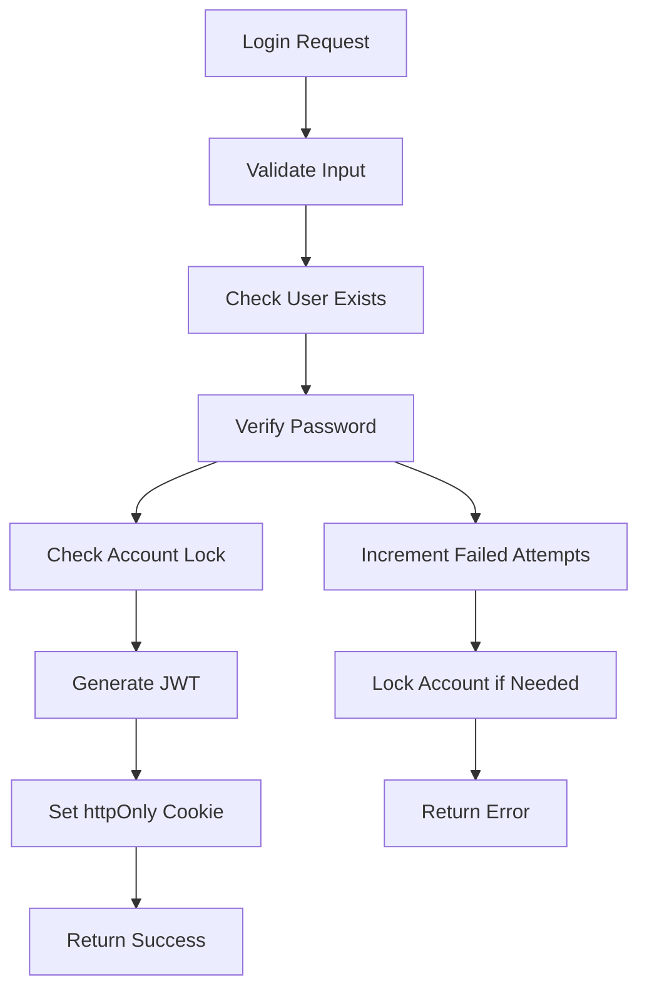
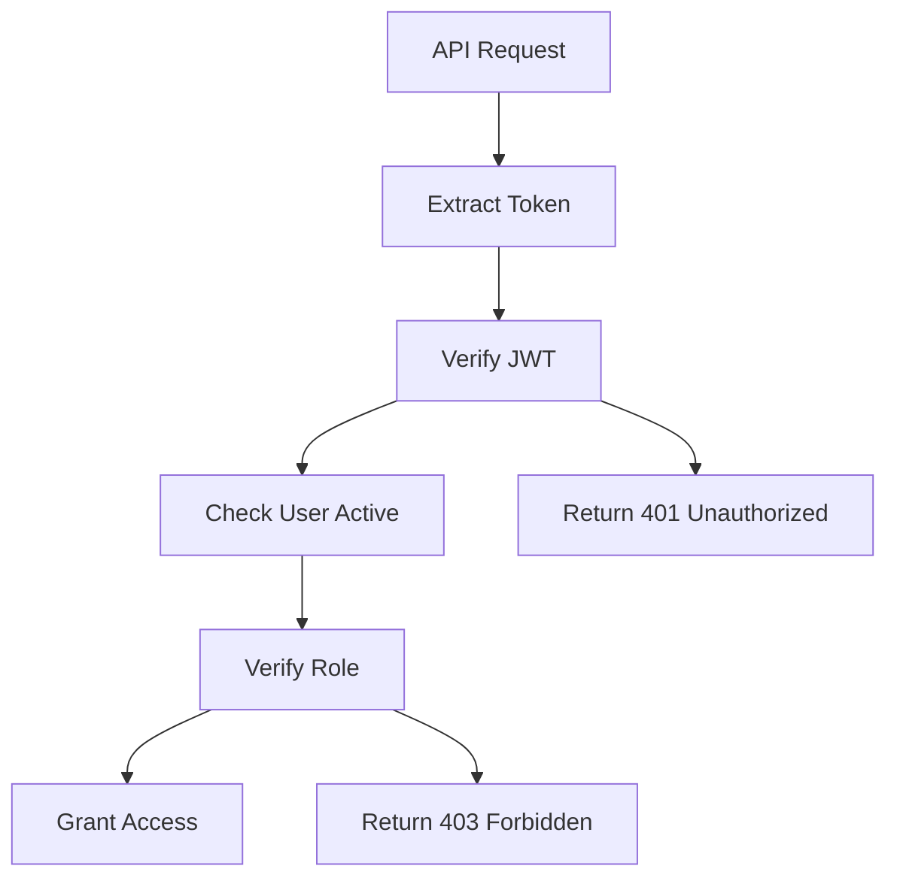
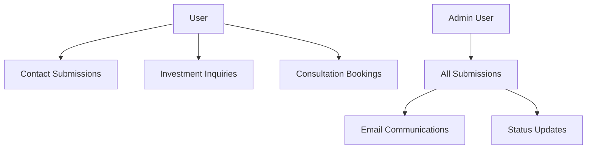
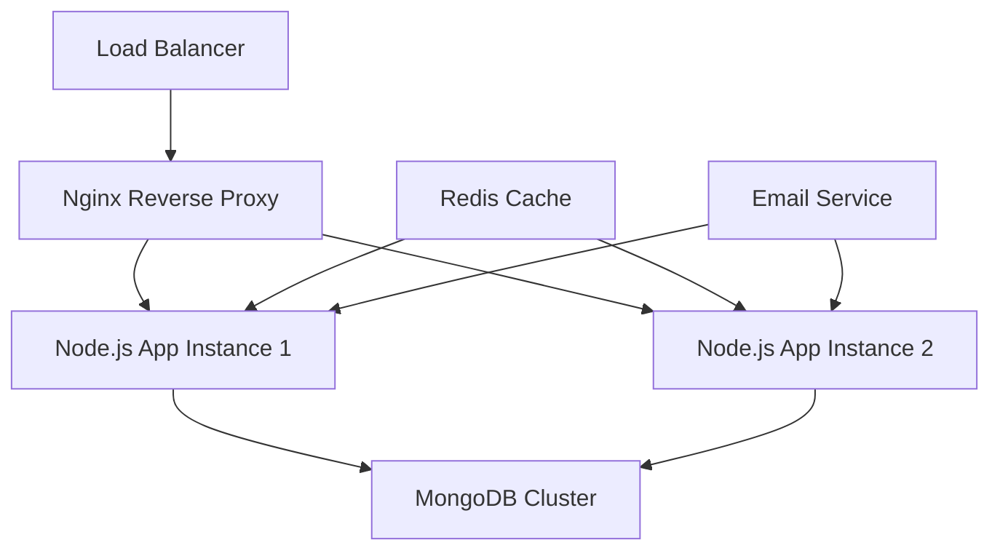

# Backend Architecture Documentation

## Overview

The ViticultWhisky backend is a robust Node.js application built with Express.js and MongoDB. It follows a modular MVC architecture with clear separation of concerns, security best practices, and scalable design patterns.

## Technology Stack

- **Runtime**: Node.js (v18+)
- **Framework**: Express.js
- **Database**: MongoDB with Mongoose ODM
- **Authentication**: JWT (JSON Web Tokens)
- **Password Hashing**: bcrypt
- **Email Service**: Nodemailer
- **File Processing**: ExcelJS for exports
- **Security**: Helmet, CORS, CSRF protection
- **Logging**: Winston logger
- **Process Management**: PM2 (production)

---

## Project Structure

```
backend/
├── config/                    # Configuration files
│   ├── admin-config.json     # Admin credentials (auto-generated)
│   ├── development.js        # Development environment config
│   ├── production.js         # Production environment config
│   ├── index.js             # Configuration index
│   └── validateEnv.js       # Environment validation
│
├── controllers/              # Request handlers
│   ├── admin.controller.js   # Admin operations (629 lines)
│   ├── auth.controller.js    # Authentication logic
│   ├── blog.controller.js    # Blog management
│   ├── consultation.controller.js  # Consultation bookings
│   ├── contact.controller.js # Contact form handling
│   ├── recovery.controller.js # Password recovery
│   └── sellWhisky.controller.js    # Sell whisky submissions
│
├── middleware/               # Express middleware
│   ├── auth.js              # JWT authentication (150 lines)
│   ├── csrf-redis.js        # Redis-based CSRF protection
│   ├── csrf.js              # CSRF token validation
│   ├── errorHandler.js      # Global error handling
│   ├── httpsEnforce.js      # HTTPS enforcement
│   ├── loginSecurity.js     # Login attempt tracking
│   ├── rateLimiter.js       # Rate limiting
│   ├── session.js           # Session management
│   └── validation.js        # Input validation
│
├── models/                   # Database schemas
│   ├── User.js              # User model (184 lines)
│   ├── Contact.js           # Contact submission model
│   ├── SellWhisky.js        # Sell whisky model
│   ├── InvestmentInquiry.js # Investment inquiry model
│   ├── Consultation.js      # Consultation booking model
│   ├── BlogPost.js          # Blog post model
│   └── SiteConfig.js        # Site configuration model
│
├── routes/                   # API route definitions
│   ├── admin.routes.js      # Admin endpoints (48 lines)
│   ├── auth.routes.js       # Authentication routes
│   ├── blog.routes.js       # Blog routes
│   ├── consultation.routes.js # Consultation routes
│   ├── contact.routes.js    # Contact routes
│   ├── recovery.routes.js   # Password recovery routes
│   ├── sellWhisky.routes.js # Sell whisky routes
│   └── config.js            # Route configuration
│
├── utils/                    # Utility functions
│   ├── appError.js          # Custom error class
│   ├── email.js             # Email service
│   ├── emailService.js      # Email sending logic
│   ├── emailTemplates.js    # Email template generation
│   ├── getClientIp.js       # IP address extraction
│   ├── logger.js            # Winston logger setup
│   ├── updateEnvPassword.js # Environment file updates
│   └── validateEnv.js       # Environment validation
│
├── scripts/                  # Automation scripts
│   ├── setup-admin.js       # Admin user creation
│   ├── db-backup.sh         # Database backup
│   ├── health-check.sh      # Health monitoring
│   ├── log-rotation.sh      # Log rotation
│   ├── security-updates.sh  # Security patches
│   └── weekly-report.sh     # Weekly reports
│
├── tests/                    # Test files
│   ├── auth.test.js         # Authentication tests
│   ├── security.test.js     # Security tests
│   └── setup.js             # Test setup
│
├── logs/                     # Application logs
│   └── access.log           # Access logs
│
├── email-templates/          # Email templates
│   └── investment-inquiry-response.html
│
├── server.js                 # Main application file
├── simple-server.js         # Simplified server
├── package.json             # Dependencies
└── ecosystem.config.js      # PM2 configuration
```

---

## Architecture Patterns

### MVC Architecture

**Model-View-Controller** pattern with clear separation:

- **Models**: Data layer with MongoDB schemas and business logic
- **Views**: JSON API responses (no server-side rendering)
- **Controllers**: Request handling and business logic orchestration

### Middleware Stack

Request processing pipeline:

```
Request → Security Headers → CORS → Rate Limiting → Authentication → CSRF → Route Handler → Response
```

### Error Handling

Centralized error handling with:
- Custom AppError class
- Global error middleware
- Structured error responses
- Environment-specific error details

---

## Core Components

### 1. Authentication System

**Location**: `middleware/auth.js`, `controllers/admin.controller.js`

**Features**:
- JWT token-based authentication
- httpOnly cookies for security
- Role-based access control (user, investor, admin)
- Account lockout protection
- Session management

**Flow**:
```
Login Request → Validate Credentials → Generate JWT → Set httpOnly Cookie → Access Granted
```

### 2. Database Layer

**Location**: `models/` directory

**Features**:
- Mongoose ODM for MongoDB
- Schema validation
- Pre/post middleware hooks
- Virtual properties
- Indexing for performance

**Key Models**:
- **User**: Authentication and user management
- **Contact**: Contact form submissions
- **SellWhisky**: Sell whisky form submissions
- **InvestmentInquiry**: Investment inquiries
- **Consultation**: Consultation bookings

### 3. Security Layer

**Components**:
- **CSRF Protection**: Token-based protection for state changes
- **Rate Limiting**: IP and user-based limits
- **Login Security**: Failed attempt tracking and lockout
- **Input Validation**: Comprehensive data validation
- **Password Security**: bcrypt hashing with salt rounds

### 4. Email System

**Location**: `utils/email.js`, `utils/emailTemplates.js`

**Features**:
- SMTP configuration with Nodemailer
- Beautiful HTML email templates
- Template generation for different types
- Email preview functionality
- Delivery tracking

### 5. File Processing

**Location**: `controllers/admin.controller.js` (exportSubmissions)

**Features**:
- Excel file generation with ExcelJS
- Multiple worksheet support
- Styled headers and formatting
- IP address and metadata inclusion
- Streaming responses for large files

---

## Security Architecture

### Authentication Flow



### Authorization Flow



### CSRF Protection

- **Token Generation**: Unique tokens per session
- **Token Validation**: Required for state-changing operations
- **Cookie Security**: httpOnly, secure flags
- **SameSite Policy**: CSRF attack prevention

---

## Database Design

### Connection Management

```javascript
// MongoDB connection with Mongoose
mongoose.connect(process.env.MONGODB_URI, {
  useNewUrlParser: true,
  useUnifiedTopology: true,
  maxPoolSize: 10,
  serverSelectionTimeoutMS: 5000,
  socketTimeoutMS: 45000,
});
```

### Schema Design Principles

1. **Validation**: Comprehensive input validation at schema level
2. **Indexing**: Strategic indexes for query performance
3. **Security**: Sensitive fields marked as `select: false`
4. **Timestamps**: Automatic created/updated timestamps
5. **Virtuals**: Computed properties for derived data

### Data Relationships



---

## API Design

### RESTful Principles

- **Resources**: Clear resource naming (contacts, submissions)
- **HTTP Methods**: Proper verb usage (GET, POST, PUT, DELETE)
- **Status Codes**: Meaningful response codes
- **Consistent Structure**: Standardized response format

### Response Format

```javascript
// Success Response
{
  "success": true,
  "data": {}, // or []
  "message": "Optional success message"
}

// Error Response
{
  "success": false,
  "message": "Error description",
  "errors": [] // Optional detailed errors
}
```

### Pagination Pattern

```javascript
// For future implementation
{
  "success": true,
  "data": [],
  "pagination": {
    "page": 1,
    "limit": 20,
    "total": 150,
    "pages": 8
  }
}
```

---

## Performance Optimization

### Database Optimization

1. **Indexing**: Strategic indexes on frequently queried fields
2. **Connection Pooling**: Efficient connection management
3. **Query Optimization**: Lean queries with field selection
4. **Aggregation**: Complex queries using MongoDB aggregation pipeline

### Application Optimization

1. **Middleware Ordering**: Efficient middleware stack
2. **Response Compression**: Gzip compression
3. **Caching**: Strategic caching of frequent queries
4. **Memory Management**: Proper resource cleanup

### File Processing

1. **Streaming**: Large file handling with streams
2. **Batch Processing**: Efficient bulk operations
3. **Memory Limits**: Controlled memory usage for exports

---

## Logging and Monitoring

### Winston Logger Configuration

```javascript
// logger.js
const winston = require('winston');

const logger = winston.createLogger({
  level: process.env.NODE_ENV === 'production' ? 'info' : 'debug',
  format: winston.format.combine(
    winston.format.timestamp(),
    winston.format.errors({ stack: true }),
    winston.format.json()
  ),
  transports: [
    new winston.transports.File({ filename: 'logs/error.log', level: 'error' }),
    new winston.transports.File({ filename: 'logs/combined.log' }),
    new winston.transports.Console()
  ]
});
```

### Log Categories

- **Authentication**: Login attempts, security events
- **API Requests**: Request/response logging
- **Database**: Query performance, errors
- **Email**: Email sending status
- **Security**: Failed attempts, suspicious activity

### Health Monitoring

- **Health Check Endpoint**: `/api/health`
- **Database Connection**: Connection status monitoring
- **Memory Usage**: Memory leak detection
- **Response Times**: Performance monitoring

---

## Environment Configuration

### Configuration Management

**Development**: `config/development.js`
```javascript
module.exports = {
  database: {
    uri: 'mongodb://localhost:27017/whisky-dev'
  },
  jwt: {
    secret: process.env.JWT_SECRET,
    expiresIn: '24h'
  },
  email: {
    host: 'localhost',
    port: 1025 // MailHog for testing
  }
};
```

**Production**: `config/production.js`
```javascript
module.exports = {
  database: {
    uri: process.env.MONGODB_URI
  },
  jwt: {
    secret: process.env.JWT_SECRET,
    expiresIn: '24h'
  },
  email: {
    host: process.env.SMTP_HOST,
    port: process.env.SMTP_PORT,
    secure: true
  }
};
```

### Environment Variables

**Required Variables**:
- `MONGODB_URI`: Database connection string
- `JWT_SECRET`: JWT signing secret
- `ADMIN_EMAIL`: Admin user email
- `ADMIN_PASSWORD_HASH`: Admin password hash

**Optional Variables**:
- `PORT`: Server port (default: 5000)
- `NODE_ENV`: Environment (development/production)
- `SMTP_*`: Email service configuration

---

## Deployment Architecture

### Production Setup



### Process Management

**PM2 Configuration** (`ecosystem.config.js`):
```javascript
module.exports = {
  apps: [{
    name: 'whisky-backend',
    script: 'server.js',
    instances: 'max',
    exec_mode: 'cluster',
    env: {
      NODE_ENV: 'production',
      PORT: 5000
    },
    error_file: './logs/err.log',
    out_file: './logs/out.log',
    log_file: './logs/combined.log'
  }]
};
```

### Scaling Considerations

1. **Horizontal Scaling**: Multiple Node.js instances
2. **Database Scaling**: MongoDB replica sets
3. **Session Storage**: Redis for session management
4. **File Storage**: External storage for uploads
5. **Caching**: Redis for application caching

---

## Security Considerations

### OWASP Top 10 Mitigation

1. **Injection**: Mongoose query sanitization
2. **Broken Authentication**: JWT with secure practices
3. **Sensitive Data Exposure**: Proper encryption and secrets management
4. **XML External Entities**: Not applicable (JSON API)
5. **Broken Access Control**: Role-based permissions
6. **Security Misconfiguration**: Environment-specific configurations
7. **Cross-Site Scripting**: Input sanitization
8. **Insecure Deserialization**: JSON parsing limits
9. **Known Vulnerabilities**: Regular dependency updates
10. **Insufficient Logging**: Comprehensive audit logs

### Security Headers

```javascript
// Helmet.js configuration
app.use(helmet({
  contentSecurityPolicy: {
    directives: {
      defaultSrc: ["'self'"],
      styleSrc: ["'self'", "'unsafe-inline'"],
      scriptSrc: ["'self'"],
      imgSrc: ["'self'", "data:", "https:"],
    },
  },
  hsts: {
    maxAge: 31536000,
    includeSubDomains: true,
    preload: true
  }
}));
```

---

## Testing Strategy

### Test Structure

```
tests/
├── unit/           # Unit tests for individual components
├── integration/    # Integration tests for API endpoints
├── security/       # Security-specific tests
└── performance/    # Performance and load tests
```

### Test Categories

1. **Authentication Tests**: Login, logout, token validation
2. **Authorization Tests**: Role-based access control
3. **API Tests**: Endpoint functionality and responses
4. **Security Tests**: CSRF, rate limiting, input validation
5. **Database Tests**: Model validation and queries

### Testing Tools

- **Jest**: Test framework
- **Supertest**: HTTP assertions
- **MongoDB Memory Server**: In-memory database for tests
- **Sinon**: Mocking and stubbing

---

## API Versioning Strategy

### Current Version: v1

All endpoints are currently unversioned but follow v1 patterns:
- `/api/admin/*` - Admin endpoints
- `/api/auth/*` - Authentication endpoints
- `/api/contact` - Public contact form
- `/api/sell-whisky` - Public sell form

### Future Versioning

For future versions, implement URL versioning:
- `/api/v2/admin/*` - Version 2 admin endpoints
- Header versioning: `Accept: application/vnd.api+json;version=2`

---

## Error Handling Strategy

### Error Classification

1. **Validation Errors**: 400 Bad Request
2. **Authentication Errors**: 401 Unauthorized  
3. **Authorization Errors**: 403 Forbidden
4. **Not Found Errors**: 404 Not Found
5. **Rate Limit Errors**: 429 Too Many Requests
6. **Server Errors**: 500 Internal Server Error

### Error Response Format

```javascript
{
  "success": false,
  "message": "Human readable error message",
  "code": "ERROR_CODE",
  "details": {
    "field": "Specific field error",
    "validation": "Validation details"
  },
  "timestamp": "2024-01-15T10:30:00.000Z",
  "path": "/api/admin/login"
}
```

---

## Future Enhancements

### Planned Features

1. **WebSocket Integration**: Real-time notifications
2. **GraphQL API**: Alternative to REST
3. **Microservices**: Service decomposition
4. **Advanced Analytics**: Usage tracking
5. **Multi-tenancy**: Multiple client support

### Technical Improvements

1. **Container Deployment**: Docker containers
2. **CI/CD Pipeline**: Automated deployment
3. **Advanced Monitoring**: APM integration
4. **Database Optimization**: Query performance
5. **Caching Layer**: Redis implementation

---

*Last Updated: January 2024*  
*Version: 1.0*  
*Architecture Document for ViticultWhisky Backend*