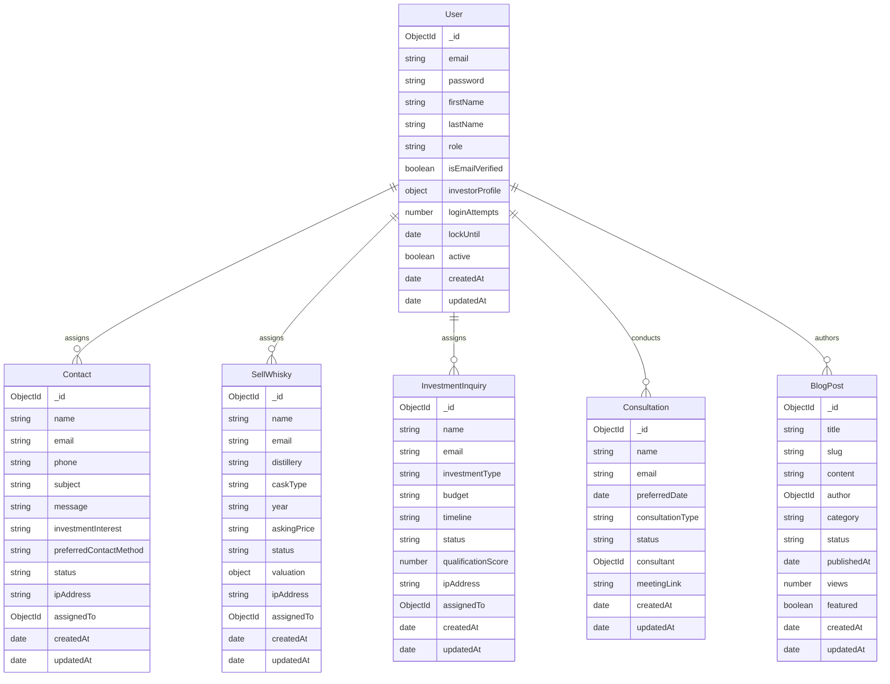

# Database Schema Documentation

## Overview

This document provides comprehensive documentation of all database models and schemas used in the ViticultWhisky backend. The application uses MongoDB with Mongoose ODM for data modeling, validation, and relationship management.

## Database Connection

**Connection String**: `mongodb://localhost:27017/whisky-investment` (development)
**Production**: Uses `MONGODB_URI` environment variable

## Schema Design Principles

1. **Validation**: Comprehensive input validation at schema level
2. **Indexing**: Strategic indexes for query performance  
3. **Security**: Sensitive fields marked as `select: false`
4. **Timestamps**: Automatic `createdAt` and `updatedAt` timestamps
5. **Virtuals**: Computed properties for derived data
6. **Middleware**: Pre/post hooks for business logic

---

## User Model

**File**: `models/User.js` (184 lines)
**Collection**: `users`

### Schema Definition

```javascript
const userSchema = new mongoose.Schema({
  email: {
    type: String,
    required: [true, 'Email is required'],
    unique: true,
    lowercase: true,
    trim: true,
    match: [/^\w+([.-]?\w+)*@\w+([.-]?\w+)*(\.\w{2,3})+$/, 'Please provide a valid email']
  },
  password: {
    type: String,
    required: [true, 'Password is required'],
    minlength: [8, 'Password must be at least 8 characters'],
    select: false // Never return password in queries
  },
  firstName: {
    type: String,
    required: [true, 'First name is required'],
    trim: true,
    maxlength: [50, 'First name cannot exceed 50 characters']
  },
  lastName: {
    type: String,
    required: [true, 'Last name is required'],
    trim: true,
    maxlength: [50, 'Last name cannot exceed 50 characters']
  },
  role: {
    type: String,
    enum: ['user', 'investor', 'admin'],
    default: 'user'
  },
  isEmailVerified: {
    type: Boolean,
    default: false
  },
  emailVerificationToken: String,
  emailVerificationExpires: Date,
  passwordResetToken: String,
  passwordResetExpires: Date,
  twoFactorSecret: String,
  twoFactorEnabled: {
    type: Boolean,
    default: false
  },
  investorProfile: {
    accreditedInvestor: {
      type: Boolean,
      default: false
    },
    investmentRange: {
      type: String,
      enum: ['5k-25k', '25k-50k', '50k-100k', '100k+']
    },
    kycCompleted: {
      type: Boolean,
      default: false
    },
    kycDocuments: [{
      type: String,
      url: String,
      uploadedAt: Date
    }]
  },
  lastLogin: Date,
  loginAttempts: {
    type: Number,
    default: 0
  },
  lockUntil: Date,
  active: {
    type: Boolean,
    default: true
  }
}, {
  timestamps: true
});
```

### Indexes

```javascript
userSchema.index({ email: 1 });
userSchema.index({ emailVerificationToken: 1 });
userSchema.index({ passwordResetToken: 1 });
```

### Virtual Properties

```javascript
// Full name virtual
userSchema.virtual('fullName').get(function() {
  return `${this.firstName} ${this.lastName}`;
});

// Check if account is locked
userSchema.virtual('isLocked').get(function() {
  return !!(this.lockUntil && this.lockUntil > Date.now());
});
```

### Methods

```javascript
// Compare passwords
userSchema.methods.comparePassword = async function(candidatePassword) {
  return await bcrypt.compare(candidatePassword, this.password);
};

// Handle failed login attempts
userSchema.methods.incLoginAttempts = function() {
  const updates = { $inc: { loginAttempts: 1 } };
  const maxAttempts = 5;
  const lockTime = 2 * 60 * 60 * 1000; // 2 hours
  
  if (this.loginAttempts + 1 >= maxAttempts && !this.isLocked) {
    updates.$set = { lockUntil: Date.now() + lockTime };
  }
  
  return this.updateOne(updates);
};

// Reset login attempts
userSchema.methods.resetLoginAttempts = function() {
  return this.updateOne({
    $set: { loginAttempts: 0 },
    $unset: { lockUntil: 1 }
  });
};

// Generate email verification token
userSchema.methods.createEmailVerificationToken = function() {
  const verificationToken = crypto.randomBytes(32).toString('hex');
  
  this.emailVerificationToken = crypto
    .createHash('sha256')
    .update(verificationToken)
    .digest('hex');
    
  this.emailVerificationExpires = Date.now() + 24 * 60 * 60 * 1000; // 24 hours
  
  return verificationToken;
};

// Generate password reset token
userSchema.methods.createPasswordResetToken = function() {
  const resetToken = crypto.randomBytes(32).toString('hex');
  
  this.passwordResetToken = crypto
    .createHash('sha256')
    .update(resetToken)
    .digest('hex');
    
  this.passwordResetExpires = Date.now() + 60 * 60 * 1000; // 1 hour
  
  return resetToken;
};
```

### Middleware

```javascript
// Hash password before saving
userSchema.pre('save', async function(next) {
  if (!this.isModified('password')) return next();
  
  try {
    const salt = await bcrypt.genSalt(12);
    this.password = await bcrypt.hash(this.password, salt);
    next();
  } catch (error) {
    next(error);
  }
});

// Hide sensitive data in JSON output
userSchema.methods.toJSON = function() {
  const user = this.toObject();
  delete user.password;
  delete user.emailVerificationToken;
  delete user.passwordResetToken;
  delete user.twoFactorSecret;
  delete user.__v;
  return user;
};
```

### Sample Document

```javascript
{
  "_id": "654abc123def456789012345",
  "email": "admin@viticult.co.uk",
  "firstName": "Admin",
  "lastName": "User",
  "role": "admin",
  "isEmailVerified": true,
  "twoFactorEnabled": false,
  "investorProfile": {
    "accreditedInvestor": false,
    "kycCompleted": false,
    "kycDocuments": []
  },
  "lastLogin": "2024-01-15T10:30:00.000Z",
  "loginAttempts": 0,
  "active": true,
  "createdAt": "2024-01-01T00:00:00.000Z",
  "updatedAt": "2024-01-15T10:30:00.000Z"
}
```

---

## Contact Model

**File**: `models/Contact.js`
**Collection**: `contacts`

### Schema Definition

```javascript
const contactSchema = new mongoose.Schema({
  name: {
    type: String,
    required: [true, 'Name is required'],
    trim: true,
    maxlength: [100, 'Name cannot exceed 100 characters']
  },
  email: {
    type: String,
    required: [true, 'Email is required'],
    lowercase: true,
    trim: true,
    match: [/^\w+([.-]?\w+)*@\w+([.-]?\w+)*(\.\w{2,3})+$/, 'Please provide a valid email']
  },
  phone: {
    type: String,
    trim: true,
    match: [/^[\+]?[\d\s\-\(\)]+$/, 'Please provide a valid phone number']
  },
  subject: {
    type: String,
    required: [true, 'Subject is required'],
    trim: true,
    maxlength: [200, 'Subject cannot exceed 200 characters']
  },
  message: {
    type: String,
    required: [true, 'Message is required'],
    trim: true,
    maxlength: [2000, 'Message cannot exceed 2000 characters']
  },
  investmentInterest: {
    type: String,
    enum: ['beginner', 'intermediate', 'premium', 'high-value'],
    default: 'beginner'
  },
  preferredContactMethod: {
    type: String,
    enum: ['email', 'phone', 'either'],
    default: 'email'
  },
  status: {
    type: String,
    enum: ['new', 'contacted', 'in-progress', 'converted', 'closed'],
    default: 'new'
  },
  notes: {
    type: String,
    maxlength: [1000, 'Notes cannot exceed 1000 characters']
  },
  ipAddress: {
    type: String,
    required: true
  },
  userAgent: String,
  lastContactedAt: Date,
  assignedTo: {
    type: mongoose.Schema.ObjectId,
    ref: 'User'
  }
}, {
  timestamps: true
});
```

### Indexes

```javascript
contactSchema.index({ email: 1 });
contactSchema.index({ status: 1 });
contactSchema.index({ createdAt: -1 });
contactSchema.index({ investmentInterest: 1 });
```

### Sample Document

```javascript
{
  "_id": "654def123abc456789012345",
  "name": "John Smith",
  "email": "john@example.com",
  "phone": "+44 20 1234 5678",
  "subject": "Whisky Cask Investment Inquiry",
  "message": "I'm interested in learning more about whisky cask investment opportunities...",
  "investmentInterest": "premium",
  "preferredContactMethod": "email",
  "status": "new",
  "ipAddress": "192.168.1.100",
  "userAgent": "Mozilla/5.0 (Windows NT 10.0; Win64; x64) AppleWebKit/537.36",
  "createdAt": "2024-01-15T10:30:00.000Z",
  "updatedAt": "2024-01-15T10:30:00.000Z"
}
```

---

## SellWhisky Model

**File**: `models/SellWhisky.js`
**Collection**: `sellwhiskies`

### Schema Definition

```javascript
const sellWhiskySchema = new mongoose.Schema({
  name: {
    type: String,
    required: [true, 'Name is required'],
    trim: true,
    maxlength: [100, 'Name cannot exceed 100 characters']
  },
  email: {
    type: String,
    required: [true, 'Email is required'],
    lowercase: true,
    trim: true,
    match: [/^\w+([.-]?\w+)*@\w+([.-]?\w+)*(\.\w{2,3})+$/, 'Please provide a valid email']
  },
  phone: {
    type: String,
    trim: true,
    match: [/^[\+]?[\d\s\-\(\)]+$/, 'Please provide a valid phone number']
  },
  distillery: {
    type: String,
    required: [true, 'Distillery is required'],
    trim: true,
    maxlength: [100, 'Distillery name cannot exceed 100 characters']
  },
  caskType: {
    type: String,
    required: [true, 'Cask type is required'],
    enum: [
      'Bourbon Barrel',
      'Sherry Hogshead',
      'Sherry Butt',
      'Port Pipe',
      'Madeira Drum',
      'Rum Barrel',
      'Wine Barrique',
      'Cognac Barrel',
      'Virgin Oak',
      'Refill Hogshead',
      'Other'
    ]
  },
  year: {
    type: String,
    required: [true, 'Year is required'],
    match: [/^\d{4}$/, 'Please provide a valid 4-digit year']
  },
  litres: {
    type: String,
    match: [/^\d+(\.\d+)?$/, 'Please provide a valid volume in litres']
  },
  abv: {
    type: String,
    match: [/^\d+(\.\d+)?$/, 'Please provide a valid ABV percentage']
  },
  askingPrice: {
    type: String,
    match: [/^\d+(\.\d+)?$/, 'Please provide a valid price']
  },
  message: {
    type: String,
    trim: true,
    maxlength: [2000, 'Message cannot exceed 2000 characters']
  },
  status: {
    type: String,
    enum: ['new', 'reviewed', 'interested', 'negotiating', 'sold', 'declined'],
    default: 'new'
  },
  valuation: {
    estimatedValue: Number,
    valuedBy: {
      type: mongoose.Schema.ObjectId,
      ref: 'User'
    },
    valuedAt: Date,
    notes: String
  },
  ipAddress: {
    type: String,
    required: true
  },
  userAgent: String,
  lastContactedAt: Date,
  assignedTo: {
    type: mongoose.Schema.ObjectId,
    ref: 'User'
  }
}, {
  timestamps: true
});
```

### Indexes

```javascript
sellWhiskySchema.index({ email: 1 });
sellWhiskySchema.index({ distillery: 1 });
sellWhiskySchema.index({ status: 1 });
sellWhiskySchema.index({ createdAt: -1 });
sellWhiskySchema.index({ year: 1 });
```

### Virtual Properties

```javascript
// Full cask description
sellWhiskySchema.virtual('caskDescription').get(function() {
  return `${this.distillery} ${this.year} - ${this.caskType}`;
});

// Has valuation
sellWhiskySchema.virtual('hasValuation').get(function() {
  return !!(this.valuation && this.valuation.estimatedValue);
});
```

### Sample Document

```javascript
{
  "_id": "654ghi123jkl456789012345",
  "name": "Jane Doe",
  "email": "jane@example.com",
  "phone": "+44 20 9876 5432",
  "distillery": "Macallan",
  "caskType": "Sherry Hogshead",
  "year": "2010",
  "litres": "250",
  "abv": "63.5",
  "askingPrice": "15000",
  "message": "Premium cask in excellent condition. Stored at bonded warehouse.",
  "status": "new",
  "valuation": {
    "estimatedValue": 14500,
    "valuedAt": "2024-01-16T09:00:00.000Z",
    "notes": "Good condition, fair market value"
  },
  "ipAddress": "192.168.1.101",
  "userAgent": "Mozilla/5.0 (Macintosh; Intel Mac OS X 10_15_7)",
  "createdAt": "2024-01-15T11:00:00.000Z",
  "updatedAt": "2024-01-16T09:00:00.000Z"
}
```

---

## InvestmentInquiry Model

**File**: `models/InvestmentInquiry.js`
**Collection**: `investmentinquiries`

### Schema Definition

```javascript
const investmentInquirySchema = new mongoose.Schema({
  name: {
    type: String,
    required: [true, 'Name is required'],
    trim: true,
    maxlength: [100, 'Name cannot exceed 100 characters']
  },
  email: {
    type: String,
    required: [true, 'Email is required'],
    lowercase: true,
    trim: true,
    match: [/^\w+([.-]?\w+)*@\w+([.-]?\w+)*(\.\w{2,3})+$/, 'Please provide a valid email']
  },
  phone: {
    type: String,
    trim: true,
    match: [/^[\+]?[\d\s\-\(\)]+$/, 'Please provide a valid phone number']
  },
  investmentType: {
    type: String,
    required: [true, 'Investment type is required'],
    enum: ['single-cask', 'portfolio', 'managed-fund', 'custom']
  },
  budget: {
    type: String,
    required: [true, 'Budget is required'],
    enum: ['5k-10k', '10k-25k', '25k-50k', '50k-100k', '100k-250k', '250k+']
  },
  timeline: {
    type: String,
    required: [true, 'Investment timeline is required'],
    enum: ['3-5-years', '5-10-years', '10-15-years', '15+-years']
  },
  riskTolerance: {
    type: String,
    enum: ['conservative', 'moderate', 'aggressive'],
    default: 'moderate'
  },
  previousExperience: {
    type: String,
    enum: ['none', 'beginner', 'intermediate', 'experienced'],
    default: 'none'
  },
  preferredDistilleries: [{
    type: String,
    trim: true
  }],
  message: {
    type: String,
    trim: true,
    maxlength: [2000, 'Message cannot exceed 2000 characters']
  },
  status: {
    type: String,
    enum: ['new', 'qualified', 'proposal-sent', 'negotiating', 'invested', 'declined'],
    default: 'new'
  },
  qualificationScore: {
    type: Number,
    min: 0,
    max: 100
  },
  proposalSent: {
    sentAt: Date,
    proposalId: String,
    amount: Number
  },
  ipAddress: {
    type: String,
    required: true
  },
  userAgent: String,
  lastContactedAt: Date,
  assignedTo: {
    type: mongoose.Schema.ObjectId,
    ref: 'User'
  }
}, {
  timestamps: true
});
```

### Indexes

```javascript
investmentInquirySchema.index({ email: 1 });
investmentInquirySchema.index({ investmentType: 1 });
investmentInquirySchema.index({ budget: 1 });
investmentInquirySchema.index({ status: 1 });
investmentInquirySchema.index({ createdAt: -1 });
```

### Methods

```javascript
// Calculate qualification score
investmentInquirySchema.methods.calculateQualificationScore = function() {
  let score = 0;
  
  // Budget scoring
  const budgetScores = {
    '5k-10k': 10,
    '10k-25k': 20,
    '25k-50k': 40,
    '50k-100k': 60,
    '100k-250k': 80,
    '250k+': 100
  };
  score += budgetScores[this.budget] || 0;
  
  // Experience scoring
  const experienceScores = {
    'none': 10,
    'beginner': 25,
    'intermediate': 50,
    'experienced': 75
  };
  score += (experienceScores[this.previousExperience] || 0) * 0.3;
  
  // Timeline scoring (longer = better)
  const timelineScores = {
    '3-5-years': 20,
    '5-10-years': 40,
    '10-15-years': 60,
    '15+-years': 80
  };
  score += (timelineScores[this.timeline] || 0) * 0.4;
  
  this.qualificationScore = Math.round(score);
  return this.qualificationScore;
};
```

### Sample Document

```javascript
{
  "_id": "654jkl123mno456789012345",
  "name": "Robert Wilson",
  "email": "robert@example.com",
  "phone": "+44 20 5555 1234",
  "investmentType": "portfolio",
  "budget": "50k-100k",
  "timeline": "10-15-years",
  "riskTolerance": "moderate",
  "previousExperience": "beginner",
  "preferredDistilleries": ["Macallan", "Glenfiddich", "Highland Park"],
  "message": "Looking to diversify my investment portfolio with whisky casks...",
  "status": "qualified",
  "qualificationScore": 75,
  "proposalSent": {
    "sentAt": "2024-01-16T14:00:00.000Z",
    "proposalId": "PROP-2024-001",
    "amount": 75000
  },
  "ipAddress": "192.168.1.102",
  "userAgent": "Mozilla/5.0 (iPhone; CPU iPhone OS 16_6 like Mac OS X)",
  "createdAt": "2024-01-15T12:00:00.000Z",
  "updatedAt": "2024-01-16T14:00:00.000Z"
}
```

---

## Consultation Model

**File**: `models/Consultation.js`
**Collection**: `consultations`

### Schema Definition

```javascript
const consultationSchema = new mongoose.Schema({
  name: {
    type: String,
    required: [true, 'Name is required'],
    trim: true,
    maxlength: [100, 'Name cannot exceed 100 characters']
  },
  email: {
    type: String,
    required: [true, 'Email is required'],
    lowercase: true,
    trim: true,
    match: [/^\w+([.-]?\w+)*@\w+([.-]?\w+)*(\.\w{2,3})+$/, 'Please provide a valid email']
  },
  phone: {
    type: String,
    trim: true,
    match: [/^[\+]?[\d\s\-\(\)]+$/, 'Please provide a valid phone number']
  },
  preferredDate: {
    type: Date,
    required: [true, 'Preferred date is required'],
    validate: {
      validator: function(date) {
        return date > new Date();
      },
      message: 'Preferred date must be in the future'
    }
  },
  preferredTime: {
    type: String,
    required: [true, 'Preferred time is required'],
    match: [/^([0-1]?[0-9]|2[0-3]):[0-5][0-9]$/, 'Please provide time in HH:MM format']
  },
  consultationType: {
    type: String,
    required: [true, 'Consultation type is required'],
    enum: [
      'general-inquiry',
      'investment-strategy',
      'portfolio-review',
      'cask-valuation',
      'market-analysis',
      'tax-advice',
      'exit-strategy'
    ]
  },
  currentInvestments: {
    hasWhiskyInvestments: {
      type: Boolean,
      default: false
    },
    portfolioValue: String,
    numberOfCasks: Number
  },
  message: {
    type: String,
    trim: true,
    maxlength: [1000, 'Message cannot exceed 1000 characters']
  },
  status: {
    type: String,
    enum: ['requested', 'confirmed', 'rescheduled', 'completed', 'cancelled', 'no-show'],
    default: 'requested'
  },
  scheduledDateTime: Date,
  consultant: {
    type: mongoose.Schema.ObjectId,
    ref: 'User'
  },
  meetingLink: String,
  meetingNotes: String,
  followUpRequired: {
    type: Boolean,
    default: false
  },
  followUpDate: Date,
  ipAddress: {
    type: String,
    required: true
  },
  userAgent: String
}, {
  timestamps: true
});
```

### Indexes

```javascript
consultationSchema.index({ email: 1 });
consultationSchema.index({ preferredDate: 1 });
consultationSchema.index({ consultationType: 1 });
consultationSchema.index({ status: 1 });
consultationSchema.index({ createdAt: -1 });
```

### Methods

```javascript
// Check if consultation is overdue
consultationSchema.methods.isOverdue = function() {
  if (this.status === 'requested' && this.preferredDate) {
    return new Date() > this.preferredDate;
  }
  return false;
};

// Generate meeting link
consultationSchema.methods.generateMeetingLink = function() {
  const meetingId = this._id.toString().substring(0, 8);
  this.meetingLink = `https://meet.viticult.co.uk/consultation/${meetingId}`;
  return this.meetingLink;
};
```

### Sample Document

```javascript
{
  "_id": "654mno123pqr456789012345",
  "name": "Sarah Johnson",
  "email": "sarah@example.com",
  "phone": "+44 20 7777 8888",
  "preferredDate": "2024-02-01T00:00:00.000Z",
  "preferredTime": "14:00",
  "consultationType": "investment-strategy",
  "currentInvestments": {
    "hasWhiskyInvestments": false,
    "portfolioValue": "100k-250k"
  },
  "message": "Would like to discuss diversifying into whisky investments...",
  "status": "confirmed",
  "scheduledDateTime": "2024-02-01T14:00:00.000Z",
  "consultant": "654abc123def456789012345",
  "meetingLink": "https://meet.viticult.co.uk/consultation/654mno12",
  "followUpRequired": true,
  "followUpDate": "2024-02-08T10:00:00.000Z",
  "ipAddress": "192.168.1.103",
  "userAgent": "Mozilla/5.0 (iPad; CPU OS 16_6 like Mac OS X)",
  "createdAt": "2024-01-15T13:00:00.000Z",
  "updatedAt": "2024-01-20T09:00:00.000Z"
}
```

---

## BlogPost Model

**File**: `models/BlogPost.js`
**Collection**: `blogposts`

### Schema Definition

```javascript
const blogPostSchema = new mongoose.Schema({
  title: {
    type: String,
    required: [true, 'Title is required'],
    trim: true,
    maxlength: [200, 'Title cannot exceed 200 characters']
  },
  slug: {
    type: String,
    required: true,
    unique: true,
    lowercase: true,
    trim: true
  },
  excerpt: {
    type: String,
    required: [true, 'Excerpt is required'],
    trim: true,
    maxlength: [500, 'Excerpt cannot exceed 500 characters']
  },
  content: {
    type: String,
    required: [true, 'Content is required']
  },
  featuredImage: {
    url: String,
    alt: String,
    caption: String
  },
  author: {
    type: mongoose.Schema.ObjectId,
    ref: 'User',
    required: true
  },
  category: {
    type: String,
    required: true,
    enum: [
      'investment-guide',
      'market-analysis',
      'distillery-profile',
      'industry-news',
      'beginner-guide',
      'tax-advice',
      'cask-types'
    ]
  },
  tags: [{
    type: String,
    trim: true,
    lowercase: true
  }],
  seo: {
    metaTitle: String,
    metaDescription: String,
    keywords: [String]
  },
  status: {
    type: String,
    enum: ['draft', 'published', 'archived'],
    default: 'draft'
  },
  publishedAt: Date,
  readingTime: {
    type: Number, // in minutes
    default: 0
  },
  views: {
    type: Number,
    default: 0
  },
  featured: {
    type: Boolean,
    default: false
  }
}, {
  timestamps: true
});
```

### Indexes

```javascript
blogPostSchema.index({ slug: 1 });
blogPostSchema.index({ status: 1, publishedAt: -1 });
blogPostSchema.index({ category: 1 });
blogPostSchema.index({ featured: -1, publishedAt: -1 });
blogPostSchema.index({ tags: 1 });
```

### Methods

```javascript
// Calculate reading time
blogPostSchema.methods.calculateReadingTime = function() {
  const wordsPerMinute = 200;
  const wordCount = this.content.split(/\s+/).length;
  this.readingTime = Math.ceil(wordCount / wordsPerMinute);
  return this.readingTime;
};

// Generate slug from title
blogPostSchema.methods.generateSlug = function() {
  this.slug = this.title
    .toLowerCase()
    .replace(/[^a-z0-9\s-]/g, '')
    .replace(/\s+/g, '-')
    .replace(/-+/g, '-')
    .trim('-');
  return this.slug;
};
```

---

## SiteConfig Model

**File**: `models/SiteConfig.js`
**Collection**: `siteconfigs`

### Schema Definition

```javascript
const siteConfigSchema = new mongoose.Schema({
  gtm: {
    containerId: {
      type: String,
      match: [/^GTM-[A-Z0-9]{7,10}$/, 'Invalid GTM container ID format']
    },
    enabled: {
      type: Boolean,
      default: false
    }
  },
  searchConsole: {
    verificationCode: String,
    sitemapUrl: {
      type: String,
      default: '/sitemap.xml'
    },
    enabled: {
      type: Boolean,
      default: false
    }
  },
  googleAnalytics: {
    measurementId: {
      type: String,
      match: [/^G-[A-Z0-9]{10}$/, 'Invalid Google Analytics Measurement ID format']
    },
    enabled: {
      type: Boolean,
      default: false
    }
  },
  seo: {
    defaultTitle: {
      type: String,
      default: 'ViticultWhisky - Premium Cask Investment'
    },
    defaultDescription: {
      type: String,
      default: 'Invest in premium Scottish whisky casks. Secure, sustainable, and profitable alternative investments.'
    },
    defaultKeywords: [{
      type: String,
      default: ['whisky investment', 'cask investment', 'scottish whisky', 'alternative investment']
    }],
    robotsTxt: {
      type: String,
      default: 'User-agent: *\nDisallow: /admin\nDisallow: /api/\nAllow: /\n\nSitemap: https://yourdomain.com/sitemap.xml'
    }
  },
  email: {
    smtpSettings: {
      host: String,
      port: Number,
      secure: Boolean,
      user: String,
      // Password stored in environment variables
    },
    fromAddress: {
      type: String,
      default: 'noreply@viticult.co.uk'
    },
    replyToAddress: String
  },
  social: {
    facebook: String,
    twitter: String,
    linkedin: String,
    instagram: String
  },
  maintenance: {
    enabled: {
      type: Boolean,
      default: false
    },
    message: String,
    allowedIPs: [String]
  }
}, {
  timestamps: true
});
```

### Singleton Pattern

```javascript
// Ensure only one site configuration document
siteConfigSchema.statics.getSiteConfig = async function() {
  let config = await this.findOne();
  if (!config) {
    config = await this.create({});
  }
  return config;
};
```

---

## Relationships

### User Relationships

```javascript
// User can have many contacts assigned
User.hasMany(Contact, { foreignKey: 'assignedTo' })

// User can have many sell submissions assigned
User.hasMany(SellWhisky, { foreignKey: 'assignedTo' })

// User can have many investment inquiries assigned
User.hasMany(InvestmentInquiry, { foreignKey: 'assignedTo' })

// User can have many consultations assigned
User.hasMany(Consultation, { foreignKey: 'consultant' })

// User can author many blog posts
User.hasMany(BlogPost, { foreignKey: 'author' })
```

### Relationship Diagram



---

## Aggregation Pipelines

### Contact Analytics

```javascript
// Get contact statistics by status
const contactStats = await Contact.aggregate([
  {
    $group: {
      _id: '$status',
      count: { $sum: 1 },
      avgResponseTime: { $avg: '$responseTime' }
    }
  },
  {
    $sort: { count: -1 }
  }
]);
```

### Investment Inquiry Qualification

```javascript
// Get qualified investment inquiries
const qualifiedInquiries = await InvestmentInquiry.aggregate([
  {
    $match: {
      qualificationScore: { $gte: 70 },
      status: { $in: ['new', 'qualified'] }
    }
  },
  {
    $lookup: {
      from: 'users',
      localField: 'assignedTo',
      foreignField: '_id',
      as: 'assignedUser'
    }
  },
  {
    $sort: { qualificationScore: -1, createdAt: -1 }
  }
]);
```

### Monthly Statistics

```javascript
// Get monthly submission statistics
const monthlyStats = await Contact.aggregate([
  {
    $group: {
      _id: {
        year: { $year: '$createdAt' },
        month: { $month: '$createdAt' }
      },
      contacts: { $sum: 1 },
      conversions: {
        $sum: {
          $cond: [{ $eq: ['$status', 'converted'] }, 1, 0]
        }
      }
    }
  },
  {
    $addFields: {
      conversionRate: {
        $multiply: [
          { $divide: ['$conversions', '$contacts'] },
          100
        ]
      }
    }
  },
  {
    $sort: { '_id.year': -1, '_id.month': -1 }
  }
]);
```

---

## Database Maintenance

### Backup Strategy

```javascript
// Daily backup script
const backup = {
  collections: [
    'users',
    'contacts', 
    'sellwhiskies',
    'investmentinquiries',
    'consultations',
    'blogposts',
    'siteconfigs'
  ],
  retentionDays: 30,
  compression: true
};
```

### Index Maintenance

```javascript
// Check index usage
db.contacts.aggregate([
  { $indexStats: {} }
]);

// Rebuild indexes if needed
db.contacts.reIndex();
```

### Data Cleanup

```javascript
// Clean up expired tokens (run daily)
await User.updateMany(
  {
    $or: [
      { emailVerificationExpires: { $lt: new Date() } },
      { passwordResetExpires: { $lt: new Date() } }
    ]
  },
  {
    $unset: {
      emailVerificationToken: 1,
      emailVerificationExpires: 1,
      passwordResetToken: 1,
      passwordResetExpires: 1
    }
  }
);

// Archive old submissions (run monthly)
const sixMonthsAgo = new Date();
sixMonthsAgo.setMonth(sixMonthsAgo.getMonth() - 6);

await Contact.updateMany(
  {
    status: 'closed',
    updatedAt: { $lt: sixMonthsAgo }
  },
  {
    $set: { archived: true }
  }
);
```

---

## Performance Optimization

### Query Optimization

1. **Use Indexes**: All frequently queried fields are indexed
2. **Limit Fields**: Use `.select()` to limit returned fields
3. **Pagination**: Implement pagination for large result sets
4. **Aggregation**: Use aggregation pipelines for complex queries

### Memory Management

1. **Connection Pooling**: Configure appropriate pool size
2. **Cursor Management**: Close cursors properly
3. **Batch Processing**: Process large datasets in batches
4. **Memory Monitoring**: Monitor memory usage in production

---

*Last Updated: January 2024*  
*Version: 1.0*  
*Database Schema Documentation for ViticultWhisky Backend*